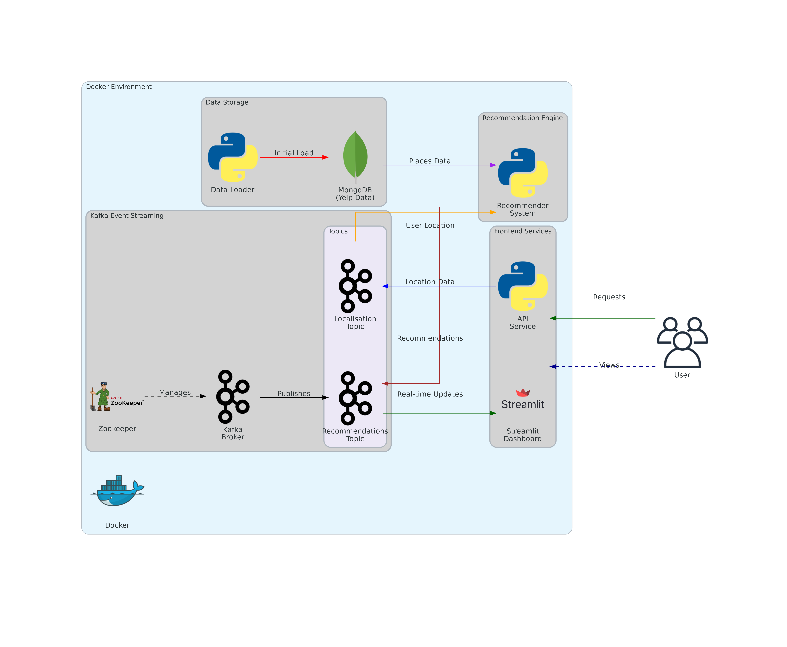

# Real time context aware : Recommandation for tourism using sentiment analysis




## Setup Instructions

Follow these steps to set up the project with Docker:

### 1. Clone the Repository

First, clone the repository to your local machine:

```bash
git clone https://github.com/AdnaneMaj/Real-time-Roc-system.git
cd Real-time-Roc-system
```

### 2. Build and Start the Containers

The project uses Docker Compose to set up the necessary containers. To build the Docker image and start the containers, run the following command:

```bash
docker build -t my-python-app -f docker/Dockerfile .
```

This command will:
- Build the Docker image as defined in the `Dockerfile`.
- Start the containers and set up any necessary services as specified in the `docker-compose.yml` file.

### 3. Access the Application

Once the containers are up, you can access your application by navigating to the appropriate port on your local machine.

For example, if the `docker-compose.yml` file exposes port 5000 for your app, you can open the application in your browser at:

```
http://localhost:5000 
```
*There is nothing here yet*

### 4. Stopping the Containers

To stop the containers, run:

```bash
docker-compose down
```

This will stop and remove the containers, networks, and volumes defined in the `docker-compose.yml` file.

### 5. Rebuilding the Image

If you make changes to the code or the `Dockerfile`, you’ll need to rebuild the image. Use the following command:

```bash
docker-compose up --build
```

This will rebuild the Docker image and restart the containers with the updated image.
